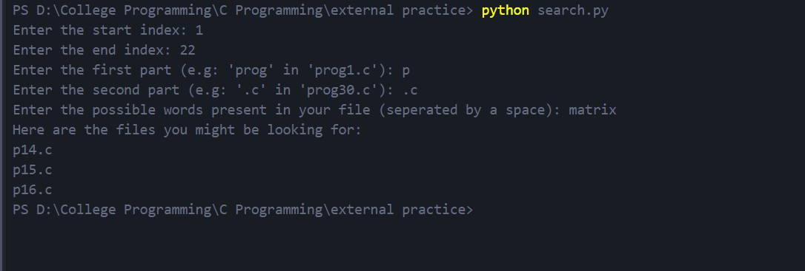

# File Search Feature

---
This is a program I've written to solve a small problem I faced. I used to practice C programs that I've been taught in my class. I used to save them for revision, with a common name, changing only the number in the name.
For example, prog1.c, prog2.c, prog3.c, etc. Like that.
I always wrote a small description of the program in a comment.
It felt ok at the start. But as the files kept increasing, it was really hard to find the program I was looking for, to revise.

So I thought, "what if I could use that decription to find the file I was looking for?" That's when I wrote this *python* program that I call **"the File Search feature"**. All I have to do is put this program file in the folder where I have my files and give the following data:
>The starting index
The end index
The first part of the name (The part before the number) (e.g: 'prog' in 'prog12.c')
The second part of the name (The part after the number) (e.g: '.c' in 'prog25.c')
Unique keywords that might be present in the file you are looking for.

And it will then look for those keywords in the files and display the names of the relevant files. And that's it! Now I no longer have to look through all of my files!

---
###Sample Output:

